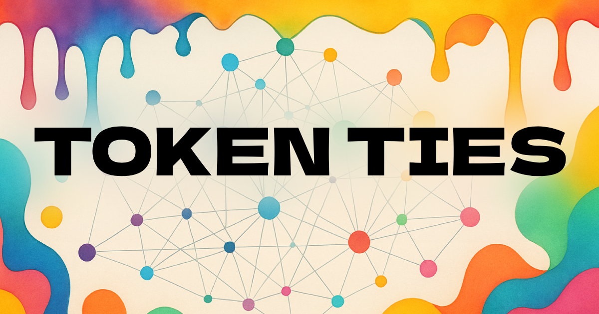

# six-degrees.art

<div align="center">
  
  
  [](https://opensource.org/licenses/MIT)
  [](https://nextjs.org/)
  [](https://www.typescriptlang.org/)
  [](https://threejs.org/)
</div>

## 🎨 Overview

six-degrees.art is an interactive visualization tool that brings NFT collections to life through stunning 3D and 2D network graphs. Explore the connections between collectors, NFTs, and contracts in an intuitive, visual way. Perfect for researchers, collectors, and anyone curious about NFT ownership patterns and collection relationships.

### ✨ Key Features

- **🌐 3D/2D Network Visualization**: Toggle between immersive 3D and clean 2D views of NFT networks
- **👥 Collector Discovery**: See who owns what and discover fellow collectors in any collection
- **🔗 Contract Relationships**: Visualize how NFTs within the same contract are connected
- **🎯 Multi-Ownership Support**: Track NFTs owned by multiple collectors (ERC-1155)
- **🎨 Beautiful UI**: Modern, responsive interface with customizable themes and backgrounds
- **⚡ Real-time Data**: Powered by OpenSea and Moralis APIs for up-to-date information
- **🔍 Smart Exploration**: Expand contracts, load more collectors, and dive deep into any collection

## 🖼️ Screenshots

<div align="center">
  
  
</div>

## 🚀 Getting Started

### Prerequisites

- Node.js 18+ and npm
- OpenSea API Key ([Get one here](https://docs.opensea.io/reference/api-keys))
- Moralis API Key ([Get one here](https://moralis.io/))

### Installation

1. **Clone the repository**
   ```bash
   git clone https://github.com/yourusername/nft-discover.git
   cd nft-discover
   ```

2. **Install dependencies**
   ```bash
   npm install
   ```

3. **Set up environment variables**
   
   Copy the example environment file and add your API keys:
   ```bash
   cp env.example .env.local
   ```
   
   Then edit `.env.local` and add your API keys:
   ```env
   OPENSEA_API_KEY=your_actual_opensea_api_key
   MORALIS_API_KEY=your_actual_moralis_api_key
   ```

4. **Run the development server**
   ```bash
   npm run dev
   ```

5. **Open your browser**
   
   Navigate to [http://localhost:3000](http://localhost:3000)

## 🛠️ Tech Stack

- **Framework**: [Next.js 15.3.5](https://nextjs.org/) with App Router
- **Language**: [TypeScript](https://www.typescriptlang.org/)
- **3D Graphics**: [Three.js](https://threejs.org/) & [react-force-graph-3d](https://github.com/vasturiano/react-force-graph)
- **Styling**: [Tailwind CSS](https://tailwindcss.com/) with [shadcn/ui](https://ui.shadcn.com/) components
- **APIs**: 
  - [OpenSea API](https://docs.opensea.io/) for NFT and profile data
  - [Moralis API](https://moralis.io/) for blockchain data and ownership info
- **Icons**: [Lucide React](https://lucide.dev/)

## 📖 Usage Guide

### Basic Usage

1. **Enter a wallet address or ENS name** in the search bar
2. **Explore the visualization**:
   - **Blue nodes**: Main profile
   - **Purple nodes**: Other collectors
   - **Image nodes**: NFTs
   - **Lines**: Ownership and contract relationships
3. **Interact with the graph**:
   - **Click and drag** to rotate (3D mode)
   - **Scroll** to zoom in/out
   - **Click nodes** for details
   - **Drag nodes** to reposition

### Advanced Features

#### Settings Panel
Access the settings (⚙️ icon) to customize:
- **NFT Fetch Limit**: Control how many NFTs to load initially (1-50)
- **Collector Fetch Limit**: Set how many collectors to show per NFT (1-20)
- **Contract Expand Limit**: Choose how many NFTs to load when expanding contracts
- **Link Transparency**: Adjust the visibility of connection lines
- **Background Theme**: Choose from various gradient backgrounds

#### Expanding Collections
- Click **"Expand Contract"** on any NFT to load more NFTs from the same collection
- Use **"Load More Collectors"** to discover additional owners
- **"Load More NFTs"** fetches the next batch from the owner's collection

## 🏗️ Architecture

```
nft-discover/
├── src/
│   ├── app/
│   │   ├── api/           # API routes for OpenSea and Moralis
│   │   ├── page.tsx       # Main visualization component
│   │   └── layout.tsx     # App layout and metadata
│   ├── components/
│   │   └── ui/           # Reusable UI components
│   └── lib/
│       └── utils.ts      # Utility functions
├── public/               # Static assets
└── package.json         # Dependencies and scripts
```

### API Endpoints

- `GET /api/opensea` - Fetch user profile data
- `GET /api/opensea/nfts` - Get NFTs owned by an address
- `GET /api/opensea/contract` - Load NFTs from a specific contract
- `GET /api/moralis/collectors` - Retrieve NFT ownership data

## 🤝 Contributing

We welcome contributions! Please see our [Contributing Guidelines](CONTRIBUTING.md) for detailed information on how to contribute to this project.

### Quick Start

1. **Fork the repository**
2. **Create a feature branch**
   ```bash
   git checkout -b feature/amazing-feature
   ```
3. **Commit your changes**
   ```bash
   git commit -m 'feat: add amazing feature'
   ```
4. **Push to the branch**
   ```bash
   git push origin feature/amazing-feature
   ```
5. **Open a Pull Request**

For more detailed guidelines, code style, and best practices, please read [CONTRIBUTING.md](CONTRIBUTING.md).

## 🐛 Known Issues & Limitations

- **API Rate Limits**: Both OpenSea and Moralis have rate limits. The app handles these gracefully but may slow down with heavy usage
- **Large Collections**: Collections with thousands of NFTs may cause performance issues
- **Cross-Chain**: Currently only supports Ethereum mainnet
- **Image Loading**: Some NFT images may fail to load due to CORS policies

## 🚀 Deployment

### Deploy on Vercel (Recommended)

1. Fork this repository
2. Create a new project on [Vercel](https://vercel.com)
3. Import your forked repository
4. Add environment variables in Vercel dashboard
5. Deploy!

### Manual Deployment

```bash
# Build the application
npm run build

# Start the production server
npm start
```

## 📜 License

This project is licensed under the MIT License - see the [LICENSE](LICENSE) file for details.

## 🙏 Acknowledgments

- [OpenSea](https://opensea.io/) for their comprehensive NFT API
- [Moralis](https://moralis.io/) for blockchain data infrastructure
- [Three.js](https://threejs.org/) community for amazing 3D graphics
- [Vercel](https://vercel.com/) for hosting and deployment

## 🔗 Links

- [Live Demo](https://nft-discover.vercel.app)
- [Report Issues](https://github.com/yourusername/nft-discover/issues)
- [Request Features](https://github.com/yourusername/nft-discover/issues/new?labels=enhancement)

---

<div align="center">
  Made with ❤️ by the NFT community, for the NFT community
</div>
